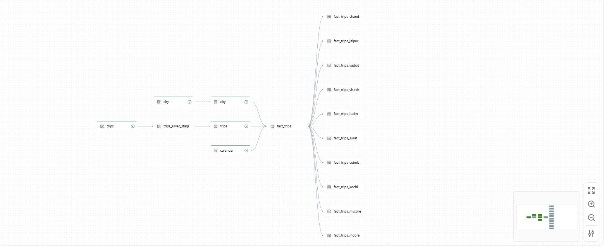

# Goodcabs Data Engineering Project

## Overview

This project demonstrates an end-to-end Data Engineering solution for **Goodcabs**, a ride-hailing company operating across multiple cities. The objective is to build a scalable and maintainable data platform using the **Medallion Architecture (Bronze, Silver, Gold)** and **Databricks Lakeflow Declarative Pipelines (SDP)**.

The project processes trip and city data stored in Amazon S3, transforms it through multiple layers, and generates business-ready datasets for regional analytics and reporting.

---

## Architecture



### Technology Stack

* Python
* Apache Spark
* Databricks Free Edition
* Lakeflow Spark Declarative Pipelines (SDP)
* Unity Catalog
* Amazon S3
* Delta Lake
* Medallion Architecture

---

## Project Objective

Regional managers at Goodcabs require timely and city-specific analytics such as:

* Total Trips
* Total Revenue
* Average Passenger Rating
* Average Driver Rating
* City-wise Performance Metrics

The existing platform relied on procedural Spark pipelines that were difficult to maintain and scale. This project demonstrates how Lakeflow Declarative Pipelines simplify development through automatic orchestration and incremental processing.

---

## Data Sources

### City Dataset

Dimension table containing:

* City ID
* City Name

### Trips Dataset

Fact table containing:

* Trip ID
* Date
* City ID
* Passenger Type
* Distance Travelled
* Passenger Rating
* Driver Rating
* Fare Amount
* And other ride-related attributes

---

## Medallion Architecture

### Bronze Layer

Raw ingestion layer.

Features:

* Reads data directly from Amazon S3.
* Stores raw records without business transformations.
* Adds metadata columns:

  * File Name
  * Ingestion Timestamp
* Uses Auto Loader for incremental file processing.

Tables:

* city
* trips

---

### Silver Layer

Data cleansing and transformation layer.

Features:

* Data validation and quality checks.
* Schema standardization.
* Metadata enrichment.
* Change Data Capture (CDC) processing.
* Streaming table creation.

Tables:

* city
* trips
* calendar

---

### Gold Layer

Business-ready analytics layer.

Features:

* Joins Trips, City, and Calendar datasets.
* Generates denormalized analytical datasets.
* Creates city-specific views for regional managers.
* Optimized for BI reporting and dashboard consumption.

---

## Key Databricks Features Used

### Lakeflow Declarative Pipelines (SDP)

* Materialized Views
* Streaming Tables
* Auto CDC Flows
* Expectations & Data Quality Rules
* Automatic Dependency Management

### Unity Catalog

* Data Governance
* Access Control
* Metadata Management

### Delta Lake

* ACID Transactions
* Change Data Feed (CDF)
* Incremental Processing

---

## Project Workflow

1. Upload source CSV files to Amazon S3.
2. Ingest data into Bronze layer using Auto Loader.
3. Clean and transform data in Silver layer.
4. Generate Calendar dimension.
5. Apply CDC processing and data quality checks.
6. Create Gold analytical datasets.
7. Build city-wise analytical views for business users.

---

## Sample Business Metrics

The platform enables analysis of:

* Revenue by City
* Trips by City
* Passenger Ratings
* Driver Ratings
* Monthly Revenue Trends
* Regional Performance Comparisons
* Weekend vs Weekday Analysis

---

## Learning Outcomes

This project demonstrates:

* Modern Data Engineering practices
* Databricks Lakeflow Declarative Pipelines
* Incremental Data Processing
* Change Data Capture (CDC)
* Delta Lake Architecture
* Medallion Data Modeling
* Cloud Data Lake Integration
* Data Quality Monitoring

---

## Repository Structure

```text
project-de-transportation-goodcabs/
│
├── notebooks/
├── bronze/
├── silver/
├── gold/
├── architecture/
├── datasets/
├── Transportation_pipeline_graph.JPG
└── README.md
```

---

## Author

**Maham Jamil**


---

## Acknowledgements

This project was inspired by a Databricks Lakeflow Spark Declarative Pipelines implementation in the transportation domain and was developed as a hands-on learning project to gain practical experience in modern data engineering workflows.
